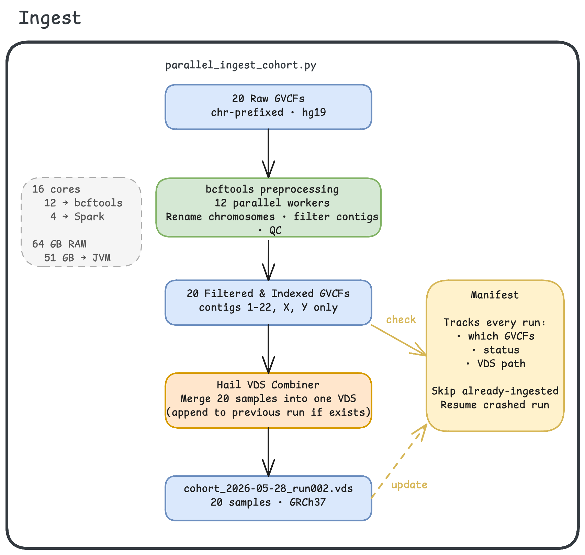
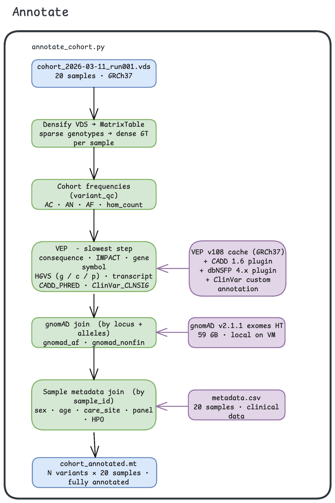
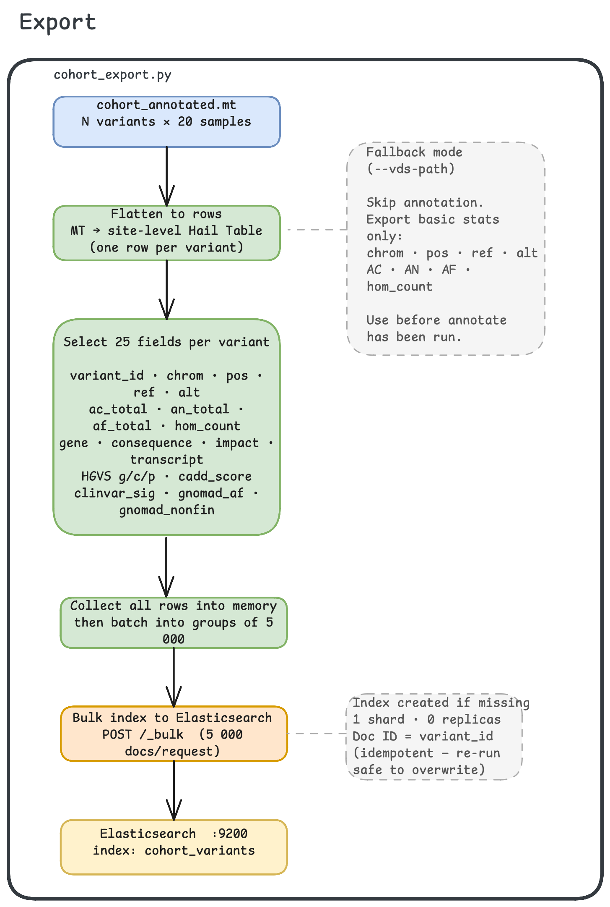
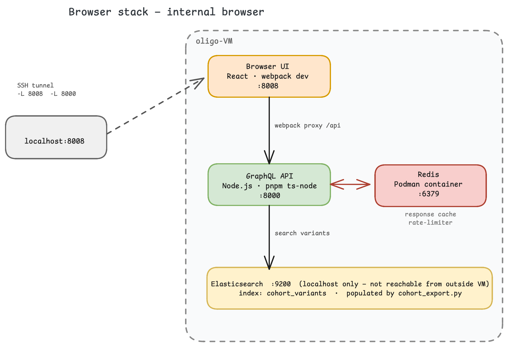

# cohort-vds-browser

Incremental GVCF ingestion pipeline with annotation and a patched gnomAD browser frontend
for WGS/WES cohort variant exploration. Runs on an internal Linux VM.
Patient-linked data stays on the internal analysis VM; a separate public VM can be
populated with sanitized, variant-level Elasticsearch exports via an explicit allowlist.

## Architecture

```
raw GVCFs → bcftools filter → Hail VDS → annotated MatrixTable → Elasticsearch → gnomAD browser
```

VDS is the raw genotype store (never modified post-ingest). The annotated MatrixTable is the
export layer: it carries `variant_qc()` cohort frequencies, VEP consequence calls, dbNSFP
predictor scores (including CADD), ClinVar significance, gnomAD population AF, and
per-sample clinical metadata. The VDS-only export path exists as a quick fallback before
annotation has been run.

Production serving uses two database tiers: the internal VM holds patient-linked data;
a separate public/browser VM receives only de-identified, variant-level documents.

---

## Pipeline

The pipeline runs in three stages, each driven by a dedicated script.

### Stage 1 — Ingest &nbsp;(`parallel_ingest_cohort.py`)



Raw GVCFs arrive with `chr`-prefixed chromosomes in GRCh37 / hg19 coordinates.
`parallel_ingest_cohort.py` fans out across **12 bcftools workers** to rename chromosomes,
strip non-canonical contigs (keeps 1–22, X, Y), and run per-sample QC in parallel.
The 20 filtered and re-indexed GVCFs are then handed to the **Hail VDS Combiner**, which
merges them into a single sparse VDS on 4 Spark cores.
If a VDS from a previous run already exists, new samples are appended rather than
re-combined from scratch.

Resource budget: **16 cores** (12 → bcftools, 4 → Spark) and **64 GB RAM** (51 GB → JVM).

### Stage 2 — Annotate &nbsp;(`annotate_cohort.py`)



`annotate_cohort.py` takes the VDS and writes a fully annotated Hail MatrixTable.
Steps run in order:

| Step | Output fields |
|---|---|
| Densify VDS → MatrixTable | dense genotype per sample |
| `hl.variant_qc()` cohort frequencies | `ac_total` · `an_total` · `af_total` · `hom_count` |
| VEP v108 (slowest step) | `consequence` · `impact` · `gene_symbol` · `transcript` · HGVS `g/c/p` · `cadd_score` · ClinVar |
| gnomAD v2.1.1 exomes HT join | `gnomad_af` · `gnomad_nonfin` |
| Sample metadata CSV join | `sex` · `date_of_birth` · `care_site` · `panel` · HPO terms |

VEP runs with the local GRCh37 cache plus the dbNSFP plugin for predictor scores
(CADD, REVEL, SIFT, PolyPhen-2, MetaRNN, ClinPred, AlphaMissense, and others).
The target annotation source is **dbNSFP v5.3.1**, which consolidates CADD and 35 other
predictors, population AF from gnomAD v4.1 / TOPMed / All of Us, and gene-level
annotations (OMIM, Orphanet, HPO, LOEUF/MOEUF) into a single join.
The gnomAD HT (59 GB) and all reference data live locally under `/mnt/sdb/reference/`.

### Stage 3 — Export &nbsp;(`cohort_export.py`)



`cohort_export.py` reads the annotated MatrixTable, collapses it to a site-level Hail
Table (one row per variant), selects the 25 export fields, and bulk-indexes them to
Elasticsearch in batches of 5 000 documents per `POST /_bulk` request.

Selected fields per document:

```
variant_id · chrom · pos · ref · alt
ac_total · an_total · af_total · hom_count
gene · consequence · impact · transcript
hgvs_g · hgvs_c · hgvs_p
cadd_score · clinvar_sig
gnomad_af · gnomad_nonfin
```

The index is created if missing (1 shard, 0 replicas). Document ID is `variant_id`,
so re-running the export is idempotent and safe to overwrite.

**Fallback mode** (`--vds-path`): skips annotation entirely and exports only
`chrom · pos · ref · alt · AC · AN · AF · hom_count`. Use this before
`annotate_cohort.py` has been run.

---

## Browser Stack



Four services run on the VM:

| Service | Port | Role |
|---|---|---|
| Browser UI (React / webpack) | 8008 | Frontend served by `webpack serve` |
| GraphQL API (Node.js / pnpm) | 8000 | Translates browser queries to ES searches |
| Redis (Podman container) | 6379 | GraphQL response cache and rate-limiter |
| Elasticsearch 8.13.4 | 9200 | Variant index — bound to `127.0.0.1` only |

Elasticsearch is never reachable from outside the host. The webpack dev server proxies
`/api` requests to the GraphQL API on port 8000.

Access the browser from a Mac over SSH tunnel:

```bash
ssh -L 8008:localhost:8008 -L 8000:localhost:8000 oligo-VM
```

Then open `http://localhost:8008` in your browser.

---

## Quick Start

Install prerequisites: Python 3.11+, Hail 0.2, bcftools, tabix, Docker or Podman, pnpm, and git.

Bootstrap the browser patch layer:

```bash
./setup.sh
```

Run the browser stack after setup:

```bash
cd gnomad-browser
docker compose up --build
```

---

## Pipeline TUI

The Textual dashboard wraps the ingest, annotate, and export scripts in one terminal UI
with step cards, live logs, progress parsing, manifest history, and launch confirmation
dialogs.

On `oligo-VM`, run the dashboard through the launcher:

```bash
cd /mnt/sdb/projects/clingen-cohort-vds-browser
scripts/clingen-tui
```

From a Mac with `oligo-VM` in SSH config, install or copy `scripts/clingen-tui` to a
directory on `PATH` such as `~/.local/bin`, then launch it from any directory:

```bash
clingen-tui
```

The launcher runs the TUI in its own Python environment and points pipeline subprocesses
at the Hail environment:

```bash
CLINGEN_PIPELINE_PYTHON=/mnt/sdb/venvs/py310/bin/python3 \
    /mnt/sdb/venvs/clingen-tui/bin/python3 -m tui
```

Keep the TUI environment separate from the Hail environment. Current Textual releases
require a newer `rich` package than Hail allows.

Default VM paths are prefilled when `.tui_config.json` does not exist:

| Field | Default |
|---|---|
| Raw GVCFs | `/mnt/sdb/data/raw_gvcfs/andmebaas_test_valim` |
| Filtered GVCFs | `/mnt/sdb/data/filtered_gvcfs/andmebaas_test_valim_filtered` |
| Output VDS dir | `/mnt/sdb/data/vds` |
| Temp base | `/mnt/sdb/data/tmp/combiner_temp` |
| Manifest | `/mnt/sdb/data/logs/ingest_manifest.json` |
| Input VDS | `/mnt/sdb/data/vds/cohort_2026-03-11_run001.vds` |
| Output MT | `/mnt/sdb/data/mt/cohort_annotated.mt` |
| gnomAD HT | `/mnt/sdb/reference/gnomad/gnomad.exomes.r2.1.1.sites.ht` |
| Elasticsearch | `http://localhost:9200` |
| ES index | `cohort_variants` (local/demo default) |

`.tui_config.json` is intentionally ignored because it contains machine-specific paths
and operator preferences. Defaults can also be overridden with environment variables:

```bash
CLINGEN_RAW_GVCF_DIR=/path/to/raw \
CLINGEN_MANIFEST_PATH=/path/to/ingest_manifest.json \
scripts/clingen-tui
```

---

## Pipeline Commands

Ingest GVCFs into VDS:

```bash
python parallel_ingest_cohort.py \
    --raw-gvcf-dir /path/to/raw_gvcfs \
    --filtered-gvcf-dir /path/to/filtered_gvcfs \
    --output-vds-dir /path/to/vds_outputs \
    --temp-base /path/to/tmp/combiner_temp \
    --manifest-path /path/to/ingest_manifest.json \
    --n-cores 16 \
    --memory-gb 64
```

Annotate and compute cohort AF:

```bash
python annotate_cohort.py \
    --vds-path /path/to/cohort.vds \
    --output-mt /path/to/cohort_annotated.mt \
    --metadata-path /path/to/metadata.csv \
    --n-cores 16 \
    --memory-gb 64 \
    --overwrite
```

Export to Elasticsearch (full — from annotated MT):

```bash
python browser/data-pipeline/cohort_export.py \
    --mt-path /path/to/cohort_annotated.mt \
    --es-url http://localhost:9200 \
    --index cohort_variants
```

Export to Elasticsearch (fallback — basic stats from VDS):

```bash
python browser/data-pipeline/cohort_export.py \
    --vds-path /path/to/cohort.vds \
    --es-url http://localhost:9200 \
    --index cohort_variants
```

---

## Documentation

- [`AGENTS.md`](AGENTS.md): how agents should work in this repo
- [`MEMORY.md`](MEMORY.md): durable project decisions
- [`TODO.md`](TODO.md): current roadmap
- [`annotation_sources.md`](annotation_sources.md): detailed annotation source mapping
- [`docs/ARCHITECTURE.md`](docs/ARCHITECTURE.md): full data model, storage layout, security model
- [`docs/DEPLOYMENT.md`](docs/DEPLOYMENT.md): step-by-step VM setup guide
- [`docs/pipeline/`](docs/pipeline/): pipeline-scoped guidance and TODO

---

## Notes

- `gnomad-browser/` is generated by `setup.sh` and is ignored by git. Edit tracked patches
  under `browser/`.
- Keep raw VCF/GVCF, VDS, MatrixTable, Hail logs, credentials, and PHI out of git.
- `setup.sh` writes package and tool caches under `/mnt/sdb/packages/` and temp/runtime
  data under `/mnt/tmp/`. These paths must exist and be writable before local setup.
